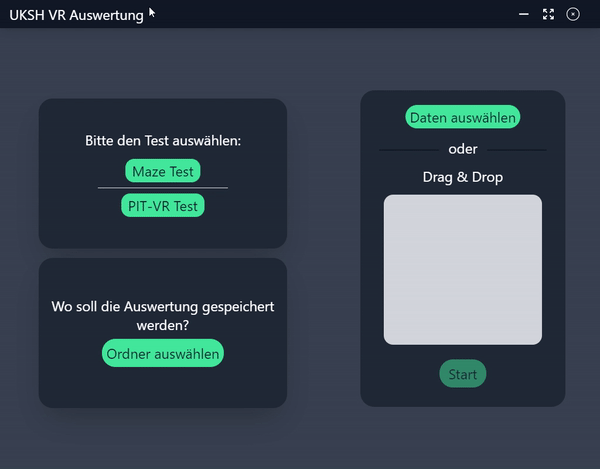

# uksh-auswertung
 A simple electron App, build with vue.
 It provides a fast and simple way to evaluate the collected data from work.

 For external person's the application is quite useless, but maybe you simply want a electron example as inspiration for your own project.

 Showcase:
 
## Project setup
```
yarn install
```

### Compiles and hot-reloads for development
```
yarn electron:serve
```

### Compiles and minifies for production
```
yarn electron:build
```


### Customize configuration
See [Configuration Reference](https://cli.vuejs.org/config/).
